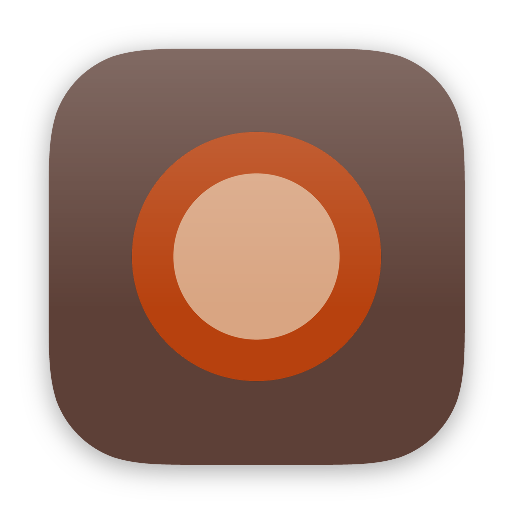
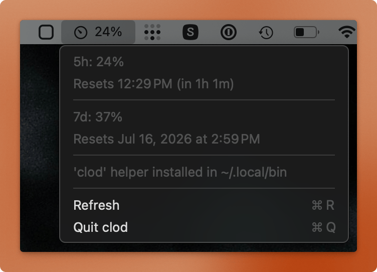

# clod

<p align="center">
  
  &nbsp;&nbsp;
  
</p>

A macOS menu bar app for keeping an eye on your Claude usage.

Usage data refreshes automatically every 5 minutes, and also when the menu bar item is opened (if not refreshed in the the last 30 seconds).

If a fetch is rate limited, clod waits 60 seconds and retries automatically.

Uses Claude Code's private API token; if it expires, run Claude code (`claude`) to refresh it.

## Develop

Requires macOS 14+, Swift 6, and [strudel](https://github.com/octavore/strudel) for building/signing/packaging.

```sh
strudel run               # builds and runs the app
strudel build --install   # builds and installs to /Applications
strudel clean
swift format --in-place --recursive Sources/
```

## License

MIT